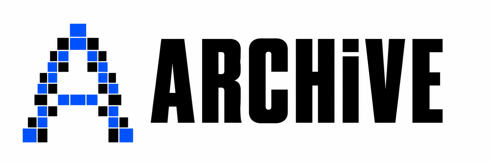
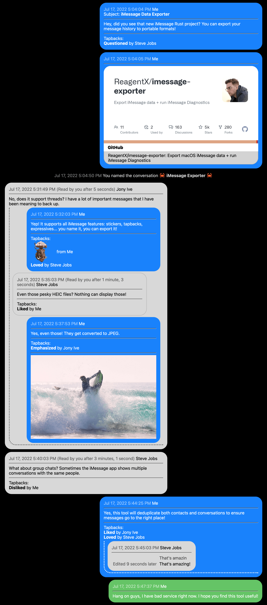

# ARCHiVE



**Your iPhone backup. Your data.**

Recover and export messages, photos, contacts, notes, and more from iPhone and
iPad backups. A local-first command-line toolkit with encrypted-backup support
and exports you can read, search, and keep.

[Quick start](#quick-start) · [What you can export](#what-you-can-export) ·
[Command reference](archive/README.md) · [Agent API](AGENTS.md) ·
[Brand assets](docs/brand/README.md)

## What you can export

| Data | Examples |
| --- | --- |
| Conversations | iMessage, SMS, RCS, WhatsApp, and message attachments |
| Photos and audio | Photos, videos, Voice Memos, voicemail, and available Recently Deleted items |
| Personal records | Contacts, calls, notes, calendars, reminders, Safari history and bookmarks |
| Device and app data | Installed apps, Home Screen layout, network usage, Bluetooth devices, app files and databases |
| Health and accounts | Workouts, quantity summaries, configured accounts, and supported keychain records |

Export to **HTML, PDF, JSON, CSV, vCard, or text**, depending on the command.
Media exports also recover the files available in the backup. Most collection
exports include a Markdown summary with totals and a time range.

Beyond individual exports, ARCHiVE can build a recovery package, combine records
into a timeline or SQLite database, search exported records, compare two backups,
and check backup integrity. Deleted-record recovery is best-effort.

**Availability depends on the backup.** ARCHiVE can recover only data present in
it. iCloud-only originals, purged files, and stores excluded by iOS may be absent.
See the [per-type reference](archive/README.md) for availability and limitations.

## Quick start

Build from source with Rust. The repository pins its toolchain in
[rust-toolchain.toml](rust-toolchain.toml).

```bash
git clone https://github.com/vaclavik-xyz/ARCHiVE.git
cd ARCHiVE
cargo build --release --workspace --locked
```

The build produces `target/release/archive` and
`target/release/imessage-exporter` (`.exe` on Windows). Keep the binaries together:
`archive messages` uses the bundled exporter for conversation transcripts.
The shell examples below use the binaries directly from the build directory.

```bash
# Discover the available data without exporting it
./target/release/archive --backup /path/to/backup inspect

# Export a browsable recovery package
./target/release/archive --backup /path/to/backup -o out recover

# Export full iMessage / SMS / RCS conversations separately
./target/release/archive --backup /path/to/backup -o out messages -f html
```

`recover` creates `out/index.html` and a root `summary.md`, plus `summary.pdf`
when a headless browser is available. It does **not** include the full Messages
transcript or the `apps` inventory; run those commands separately.
Use `recover --no-files` for a metadata-only package.

### Encrypted backups

Supply the password through `ARCHIVE_PASSWORD` or the `--password` flag.
Headless runs never prompt. In a Bash or Zsh terminal, you can read the password
without putting its value in shell history:

```bash
printf 'Backup password: '
read -r -s ARCHIVE_PASSWORD
printf '\n'
export ARCHIVE_PASSWORD
./target/release/archive --backup /path/to/backup inspect
unset ARCHIVE_PASSWORD
```

### Common exports

```bash
# Contacts you can import into an address book
./target/release/archive --backup /path/to/backup -o out contacts -f vcf

# Photo gallery with available media files
./target/release/archive --backup /path/to/backup -o out photos -f html

# Apple Notes as structured data
./target/release/archive --backup /path/to/backup -o out notes -f json

# WhatsApp transcript and media
./target/release/archive --backup /path/to/backup -o out whatsapp -f html

# A combined chronological view
./target/release/archive --backup /path/to/backup -o out timeline -f html

# Verify backup completeness
./target/release/archive --backup /path/to/backup integrity
```

For the full command list and flags, see [archive/README.md](archive/README.md)
and [AGENTS.md](AGENTS.md), or run `./target/release/archive --help`.

### Optional tools

- **PDF reports:** in-process HTML exports use a headless Chrome, Chromium, or
  Edge browser. Set `--chrome-path` if automatic detection fails. Messages PDF
  export uses Quartz on macOS and a headless browser elsewhere.
- **Audio conversion:** `ffmpeg` is needed when requesting audio transcoding;
  native audio copies do not require it.
- **Fresh device backups:** `archive -o out backup` uses `libimobiledevice` to
  create a backup from a connected iPhone.

## Built for scripts and agents

The `archive` CLI returns one JSON object on stdout for handled commands,
with progress on stderr. A successful export reports output paths and counts;
missing stores are reported explicitly. Argument-parsing errors are a separate
channel and may produce only stderr.

The [agent contract](AGENTS.md) documents flags, JSON envelopes, exit codes,
authentication behavior, and empty-store handling. The separate
`imessage-exporter` binary has its own CLI and output contract.

## Messages exporter and library

ARCHiVE includes two upstream-derived crates:

- [`imessage-exporter`](imessage-exporter/README.md) exports conversations to
  HTML, text, or PDF and runs database diagnostics.
- [`imessage-database`](imessage-database/README.md) exposes message data as
  native Rust structures.

The exporter preserves supported message features such as replies, tapbacks,
edits, formatted text, and attachments. See the [feature guide](docs/features.md),
[diagnostics guide](docs/diagnostics.md), and [Messages FAQ](docs/faq.md).

<details>
<summary>Example Messages HTML export</summary>



</details>

## Development

```bash
cargo fmt --all -- --check
cargo clippy --workspace --all-targets --locked -- -D warnings
cargo test --workspace --locked
```

The workspace contains `archive` (the recovery CLI), `archive-core` (backup
opening, decryption, and file access), and the two Messages crates above.

## Provenance and license

ARCHiVE builds on [ReagentX/imessage-exporter](https://github.com/ReagentX/imessage-exporter)
and tracks its ongoing Messages development. The `imessage-database` and
`imessage-exporter` crates originate from that project; `archive` and
`archive-core` are original to ARCHiVE.

ARCHiVE is a derivative work released under **GPL-3.0-or-later**.
See [LICENSE](LICENSE).

## Special Thanks

- All of my friends, for putting up with me sending them random messages to test things
- [SQLiteFlow](https://www.sqliteflow.com), the SQL viewer I used to explore and reverse engineer the iMessage database
- [Xplist](https://github.com/ic005k/Xplist), an invaluable tool for reverse engineering the `payload_data` plist format
- [Compart](https://www.compart.com/en/unicode/), an amazing resource for looking up esoteric unicode details
- [GNU Project](https://github.com/gnustep/libobjc) and [Archive.org](https://archive.org/details/darwin_0.1), for hosting source code referenced to reverse engineer the `typedstream` format
