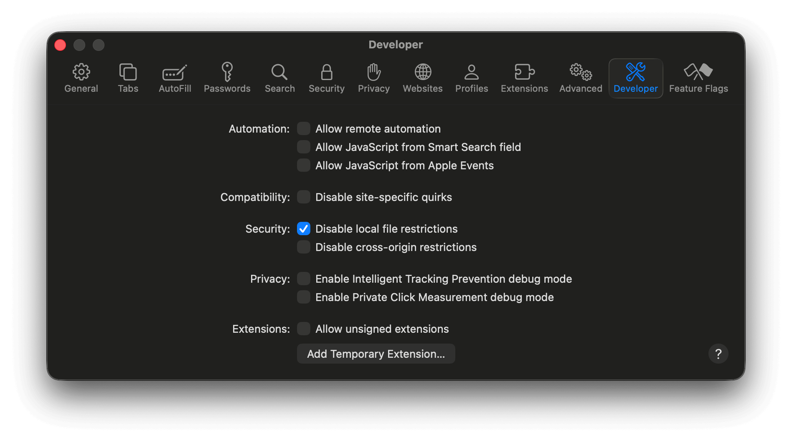

# Binary Documentation

The `imessage-exporter` binary exports iMessage data to `txt` or `html` formats. It can also run diagnostics to find problems with the iMessage database.

## Installation

There are several ways to install this software.

### Cargo (recommended)

This binary is available on [crates.io](https://crates.io/crates/imessage-exporter).

`cargo install imessage-exporter` is the best way to install the app for normal use.

<details><summary>Upgrade steps</summary><p><pre>$ cargo uninstall imessage-exporter
$ cargo install imessage-exporter</pre></p></details>

<details><summary>Uninstall steps</summary><p><pre>$ cargo uninstall imessage-exporter</pre></p><p>Optional: uninstall Rust<pre>$ rustup self uninstall</pre></p></details>

### Homebrew

This binary is available via [`brew`](https://formulae.brew.sh/formula/imessage-exporter).

`brew install imessage-exporter` will install the app, but it may not be up to date with the latest release.

<details><summary>Upgrade steps</summary><p><pre>$ brew upgrade</pre></p></details>

<details><summary>Uninstall steps</summary><p><pre>$ brew uninstall imessage-exporter</pre></p></details>

### Prebuilt Binaries

The [releases page](https://github.com/ReagentX/imessage-exporter/releases) provides prebuilt binaries for both Apple Silicon and Intel-based Macs.

<details><summary>Upgrade steps</summary><p>Download new releases as available</p></details>

<details><summary>Uninstall steps</summary><p><pre>$ rm path/to/imessage-exporter-binary</pre></p></details>

### Installing manually

- `clone` the repository
- `cd` to the repository
- `cargo run --release` to compile

## How To Use

```txt
-d, --diagnostics
        Print diagnostic information and exit
        
-f, --format <txt, html>
        Specify a single file format to export messages into
        
-c, --copy-method <clone, basic, full, disabled>
        Specify an optional method to use when copying message attachments
        `clone` will copy all files without converting anything
        `basic` will copy all files and convert HEIC images to JPEG
        `full` will copy all files and convert HEIC files to JPEG, CAF to MP4, and MOV to MP4
        If omitted, the default is `disabled`
        ImageMagick is required to convert images on non-macOS platforms
        ffmpeg is required to convert audio on non-macOS platforms and video on all platforms
        
-p, --db-path <path/to/source>
        Specify an optional custom path for the iMessage database location
        For macOS, specify a path to a `chat.db` file
        For iOS, specify a path to the root of a device backup directory
        If the iOS backup is encrypted, --cleartext-password must be passed
        If omitted, the default directory is ~/Library/Messages/chat.db
        
-r, --attachment-root <path/to/attachments>
        Specify an optional custom path to look for attachment data in
        Only use this if attachments are stored separately from the database's default location
        The provided path should be absolute
        This option affects both the `Attachments` and `StickerCache` directories
        Also works with jailbroken iOS sms.db databases (`use --platform macOS`)
        Has no effect on iOS backups
        The default location is ~/Library/Messages
        
-a, --platform <macOS, iOS>
        Specify the platform the database was created on
        If omitted, the platform type is determined automatically
        
-o, --export-path <path/to/save/files>
        Specify an optional custom directory for outputting exported data
        If omitted, the default directory is ~/imessage_export
        
-s, --start-date <YYYY-MM-DD>
        The start date filter
        Only messages sent on or after this date will be included
        
-e, --end-date <YYYY-MM-DD>
        The end date filter
        Only messages sent before this date will be included
        
-l, --no-lazy
        Do not include `loading="lazy"` in HTML export `img` tags
        This will make pages load slower but PDF generation work
        
-m, --custom-name <custom-name>
        Specify an optional custom name for the database owner's messages in exports
        Conflicts with --use-caller-id
        
-i, --use-caller-id
        Use the database owner's caller ID in exports instead of "Me"
        Conflicts with --custom-name
        
-b, --ignore-disk-warning
        Bypass the disk space check when exporting data
        By default, exports will not run if there is not enough free disk space
        
-t, --conversation-filter <filter>
        Filter exported conversations by contact names, numbers, or emails
        To provide multiple filter criteria, use a comma-separated string
        All conversations with the specified participants are exported, including group conversations
        Example: `-t steve@apple.com,5558675309`
        
-x, --cleartext-password <password>
        Optional password for encrypted iOS backups
        This is only used when the source is an encrypted iOS backup directory
        
-n, --contacts-path <path>
        Optional custom path for a macOS or iOS contacts database file
        This should be resolved automatically, but can be manually provided
        Handles from the messages table will be mapped to names in the provided database
        Generally, one of `AddressBook-v22.abcddb` or `AddressBook.sqlitedb`
        
-h, --help
        Print help
-V, --version
        Print version
```

### Examples

Export as `html` and copy attachments in web-compatible formats from the default iMessage Database location to your home directory:

```zsh
imessage-exporter -f html -c full
```

Export as `txt` and copy attachments in their original formats from the default iMessage Database location to a new folder in the current working directory called `output`:

```zsh
imessage-exporter -f txt -o output -c clone
```

Export as `txt` from an iPhone backup located at `~/iphone_backup_latest` to a new folder in the current working directory called `backup_export`:

```zsh
imessage-exporter -f txt -p ~/iphone_backup_latest -a iOS -o backup_export
```

Export as `html` from `/Volumes/external/chat.db` to `/Volumes/external/export` without copying attachments:

```zsh
imessage-exporter -f html -c disabled -p /Volumes/external/chat.db -o /Volumes/external/export
```

Export as `html` from `/Volumes/external/chat.db` to `/Volumes/external/export` with attachments in `/Volumes/external/Attachments`:

```zsh
imessage-exporter -f html -c clone -p /Volumes/external/chat.db -r /Volumes/external/Attachments -o /Volumes/external/export 
```

Export messages from `2020-01-01` to `2020-12-31` as `txt` from the default macOS iMessage Database location to `~/export-2020`:

```zsh
imessage-exporter -f txt -o ~/export-2020 -s 2020-01-01 -e 2021-01-01 -a macOS
```

Export messages from a specific participant as `html` and copy attachments in their original formats from the default iMessage Database location to your home directory:

```zsh
imessage-exporter -f html -c clone -t "5558675309"
```

Export messages from a specific participant's name as `txt` and without attachments from the default iMessage Database location to your home directory:

```zsh
imessage-exporter -f txt -t "Steve Jobs"
```

Export messages from multiple specific participants as `html` without attachments from the default iMessage Database location to your home directory:

```zsh
imessage-exporter -f html -t "5558675309,steve@apple.com"
```

Export messages from participants matching a specific country and area code as `html` without attachments from the default iMessage Database location to your home directory:

```zsh
imessage-exporter -f html -t "+1555"
```

Export messages from participants using email addresses but not phone numbers as `html` without attachments from the default iMessage Database location to your home directory:

```zsh
imessage-exporter -f html -t "@"
```

## Features

[Click here](../docs/features.md) for a full list of features.

## Caveats

### Cross-platform attachment conversion

[ImageMagick](https://imagemagick.org/index.php) is required to make exported images more compatible on non-macOS platforms.

[ffmpeg](https://ffmpeg.org) is required to make exported audio more compatible on non-macOS platforms and exported video more compatible on all platforms.

### Contacts

`imessage-exporter` will automatically attempt to resolve handle details (email addresses and phone numbers) against contacts found either in the provided iOS backup or on the local macOS Address Book. Users can optionally pass in a path to an Address Book database, but this should generally not be necessary.

### HTML Exports

In HTML exports in Safari, when referencing files in-place, you must permit Safari to read from the local file system in the `Develop > Developer Settings...` menu:



Further, since the files are stored in `~/Library`, you will need to grant your browser Full Disk Access in System Settings.

Note: This is not required when passing a valid `--copy-method`.

#### Custom Styling for HTML Exports

You can customize the appearance of HTML exports by creating your own CSS file:

1. Create a file named `style.css` in the same directory as your exported files
2. Add your custom styles to this file
3. These styles will be automatically applied to your exported HTML files

Since custom styles are loaded after the default styles, they should automatically override rules with the same specificity.

##### Example Custom CSS

For example, to prevent messages from breaking across pages when printing:

```css
.message {
    break-inside: avoid;
}
```

The default styles can be viewed [here](/imessage-exporter/src/exporters/resources/style.css).

### PDF Exports

I could not get PDF export to work in a reasonable way. The best way for a user to do this is to follow the steps above for Safari and print to PDF.

#### `wkhtmltopdf`

`wkhtmltopdf` refuses to render local images, even with the flag enabled like so:

```rust
let mut process = Command::new("wkhtmltopdf")
.args(&vec![
    "--enable-local-file-access".to_string(),
    html_path,
    pdf_path.to_string_lossy().to_string(),
])
.spawn()
.unwrap();
```

This persisted after granting `cargo`, `imessage-exporter`, and `wkhtmltopdf` Full Disk Access permissions as well as after copying files to the same directory as the `HTML` file.

#### Browser Automation

There are several `chomedriver` wrappers for Rust. The ones that use async make this binary too large (over `10mb`) and have too many dependencies. The sync implementation in the `headless-chrome` crate works, but [times out](https://github.com/atroche/rust-headless-chrome/issues/319) when generating large `PDF`s, even with an extreme timeout.
